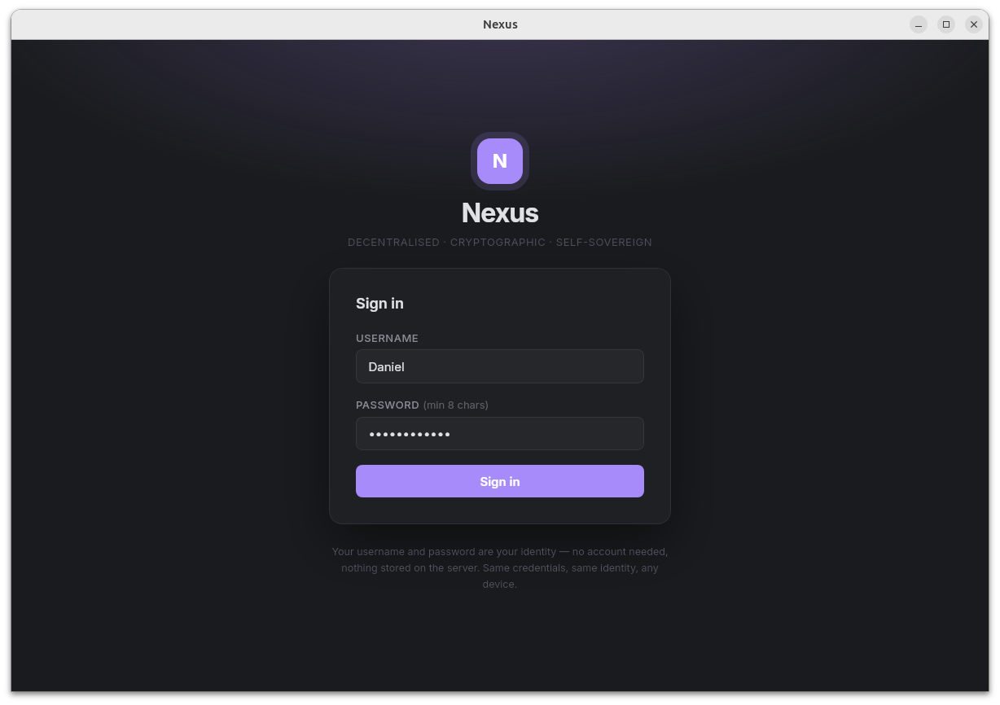
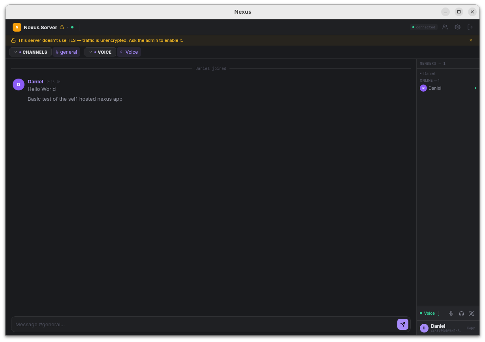

# Nexus

> Self-sovereign communication platform with cryptographic identity and peer-to-peer connectivity

Nexus is a decentralized communication platform that aims for a simple user experience with cryptographic identity. Your username and password deterministically generate an Ed25519 keypair—no registration, no email, no phone number required.

## Screenshots
### Login

### Main Window


## Features

- **Cryptographic Identity** - Ed25519 keypairs derived from username + password
- **Deterministic GUIDs** - Same credentials always produce the same identity
- **P2P Connectivity** - Connect by server code, no IP addresses or domains needed
- **End-to-End Encryption** - All connections encrypted via QUIC (iroh)
- **NAT Traversal** - Automatic hole-punching with relay fallback
- **Voice Chat** - Built-in SFU for low-latency voice channels
- **Zero Configuration** - No TLS certificates, no port forwarding, no DNS
- **Multiple Clients** - Desktop app and web client
- **Privacy-First** - Self-hosted, local-first data storage

## Quick Start

### Run a Server

**Docker (recommended):**
*Under Construction*

**Run Binary Directly:**
Simply run `nexus-server`. On first start it generates a persistent identity and prints a **server code**:

```
  SERVER CODE (share with clients to connect):
  nxs1u3cp3m5v0yxla7z77pfpqcurrfhth0y28anccwwmx4wjsjkuduasgwuzmn
```

That's it. No ports to open, no domains to configure, no certificates to manage.

### Connect as a User

1. Open the web client or desktop app
2. Paste the server code
3. Login with username + password

> Your identity is deterministic: same username + password = same GUID across all clients and servers.

## How It Works

### Identity
```
Username + Password
        ↓
    Argon2id (password derivation)
        ↓
   Ed25519 Keypair
        ↓
  SHA256(Public Key)
        ↓
      GUID
```

Your GUID is your identity. No server stores your password. Authentication uses challenge-response with digital signatures.

## Platform Support

### Current Release Platforms

**Server**
- Ubuntu (x86_64)
- Windows (x86_64)
- Docker Compose (x86_64)

**Desktop App:**
- Linux (x86_64) - AppImage
- Windows (x86_64) - MSI